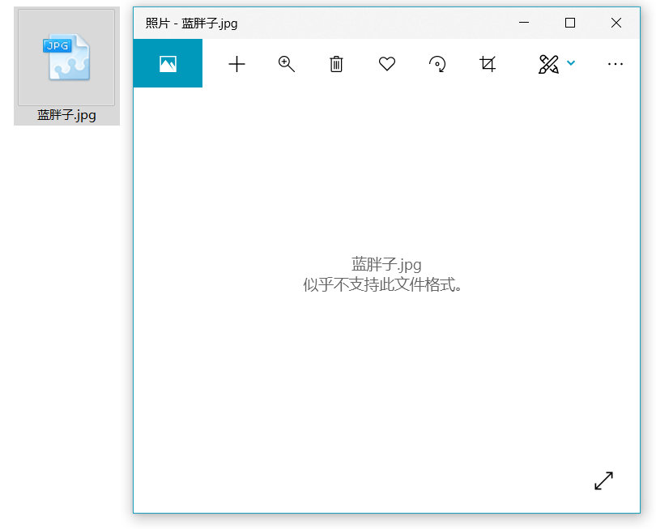

# 文件下载内容乱码 #

> 最近整理代码的时候发现了一个以前从没遇到过的问题：在 `Spring MVC 4.3.10.RELEASE` 框架下编写文件下载功能时，下载下来的文件出现了内容乱码的情况（其实也不是乱码，内容实际上是字节数组转换的成的字符串），而且不管中英文，都有问题。而文件名却不管中英文都没问题。于是便开始查找问题的所在。幸运的是没过多久便找到了的“犯罪嫌人”，以下是案件记录。  

## 受害人代表 ##

**测试.txt（案发前）**  

    我是SupremeSir  

**测试.txt（案发后）**

	"5oiR5pivU3VwcmVtZVNpcg=="  

嫌疑人真是心狠手辣，打的 `测试.txt` 都傻了。案发前心里（文件内容）还知道自己是 `SupremeSir` ，案发后竟然只会说：“ `我是谁？我在哪？我在干什么？` ”  

**蓝胖胖.jpg（案发前）**  

  

**蓝胖胖.jpg（案发后）**  

  

简直太残忍，怎么可以对胖胖动手，胖胖这么可爱~！


## 犯罪嫌疑人 ##

**spring-mvc.xml**  

```xml
<!-- 添加注解驱动 -->
<mvc:annotation-driven>
    <mvc:message-converters register-defaults="true">
        <!--避免IE执行AJAX时，返回JSON出现下载文件 -->
        <bean id="mappingJacksonHttpMessageConverter"
              class="org.springframework.http.converter.json.MappingJackson2HttpMessageConverter">
            <property name="supportedMediaTypes">
                <list>
                    <value>text/html;charset=UTF-8</value>
                </list>
            </property>
        </bean>
    </mvc:message-converters>
</mvc:annotation-driven>  
```

供词：由于 `MappingJackson2HttpMessageConverter` 对返回值 `ResponseEntity<byte[]>` 做了转换，原本的字节数组变成了内容为字节数组的字符串，所以才出现了本案发生的事件。

**FileController.java**  

```java
import org.apache.commons.io.FileUtils;
import org.apache.commons.lang3.StringUtils;
import org.springframework.context.annotation.Scope;
import org.springframework.http.HttpHeaders;
import org.springframework.http.HttpStatus;
import org.springframework.http.MediaType;
import org.springframework.http.ResponseEntity;
import org.springframework.stereotype.Controller;
import org.springframework.web.bind.annotation.RequestMapping;

import java.io.File;
import java.io.FileNotFoundException;

@Controller
@Scope("prototype")
@RequestMapping("file")
public class FileController {

    @RequestMapping(value = "downLoad")
    public ResponseEntity<byte[]> downLoad(String fileName){
        try {
            if (StringUtils.isNoneBlank(fileName)) {
                // 获取要下载的文件存放路径
                String filePath = "E:/";
                // 设置响应头
                HttpHeaders headers = new HttpHeaders();
                headers.setContentDispositionFormData("attachment", new String(fileName.getBytes("utf-8"), "ISO-8859-1"));
                // 设置响应内容类型
                headers.setContentType(MediaType.APPLICATION_OCTET_STREAM);
                // 判断文件是否存在
                File downloadFile = new File(filePath +  fileName);
                if(downloadFile.exists()){
                    // 返回文件流
                    return new ResponseEntity<byte[]>(FileUtils.readFileToByteArray(downloadFile), headers, HttpStatus.CREATED);
                }else{
                    // 抛出文件未找到异常
                    throw new FileNotFoundException();
                }
            }
        } catch (Exception e) {
            e.printStackTrace();
        }
        return null;
    }
}  
```

供词：`@RequestMapping` 注解参数缺失，勾结 `MappingJackson2HttpMessageConverter` 对象，联合做案。  

## 判决书 ##

1、编写自己的 `MappingJackson2HttpMessageConverter` 对象，使其对 `ResponseEntity<byte[]>` 类型返回值不做转换。  

**MyHttpMessageConverter.java**

```java
import org.springframework.http.converter.json.MappingJackson2HttpMessageConverter;

/**
 * @ClassName MyHttpMessageConverter
 * @Description  MappingJackson2HttpMessageConverter 对象的继承，重写其中的方法
 * @Author SupremeSir
 * @Date 2019/7/9 10:41
 * @Version 1.0
 **/
public class MyHttpMessageConverter extends MappingJackson2HttpMessageConverter {
    
    /**
     * @Author  SupremeSir
     * @Description  重写父类中的 supports 方法，防止文件下载功能因 ResponseEntity<byte[]> 返回结果转换为字符串
     * 而导致的下载的文件无法正常打开或内容乱码
     * @Date  2019/7/9 10:51
     * @Param  [clazz]
     * @return  boolean
     **/
    @Override
    protected boolean supports(Class<?> clazz) {
        if (clazz.equals(byte[].class)) {
            return false;
        }
        return true;
    }
}
```

2、修改 `spring-mvc.xml` 文件，配置自定义 `MyHttpMessageConverter` 对象。  

**spring-mvc.xml**  

```xml
<!-- 添加注解驱动 -->
<mvc:annotation-driven>
    <mvc:message-converters register-defaults="true">
        <!--避免IE执行AJAX时，返回JSON出现下载文件 -->
        <bean id="mappingJacksonHttpMessageConverter"
              class="com.supreme.utils.MyHttpMessageConverter">
            <property name="supportedMediaTypes">
                <list>
                    <value>text/html;charset=UTF-8</value>
                </list>
            </property>
        </bean>
    </mvc:message-converters>
</mvc:annotation-driven>  
```

3、补全 `@RequestMapping` 注解参数  

**MyHttpMessageConverter.java**  

```java
@RequestMapping(value = "downLoad",produces="application/octet-stream;charset=UTF-8")
public ResponseEntity<byte[]> downLoad(String fileName){
	// ……
}  
```

## 退庭 ##

