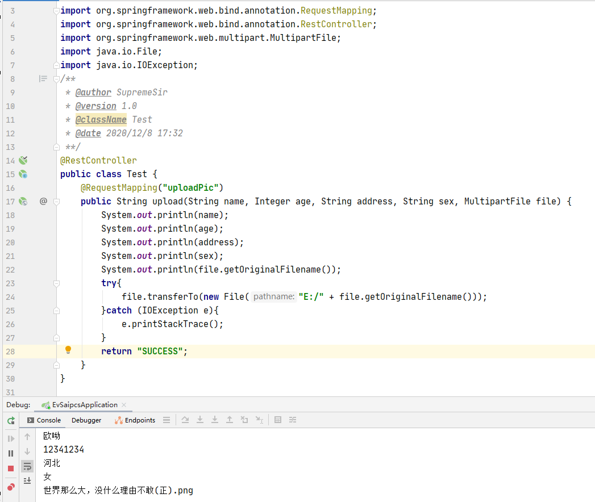

# 表单之怎么图片预览？如何异步上传？数据快速获取？

## 引

作为一名啥都懂点，啥都不通的全栈攻城狮，工作中难免会因为自己的`“奇思妙想”`给自己带来麻烦。比如：我就是想要和别人做的网站一样，图片还没上传就能预览；就是想要自定义文件上传样式，讨厌浏览器的默认样式；就是想要异步提交表单、上传文件，贼烦每次提交表单都执行跳转页面；就是想要快速读取表单元素的值，厌恶繁琐的 `jQuery` 选择器挨个读取。那，我该怎么办？？？

## 练

俗话说的好 `“Ctrl C V 用的好，今年工资涨的早”`。像我这种爱自我为难的人，是一定会自我安慰的。我的安慰方式很简单：想，那就实现它~！！！

```html
<!DOCTYPE html>
<html>
<head>
	<title>表单</title>
	<script type="text/javascript" src="jquery-3.4.1.min.js"></script>
</head>
<body>
	<form class="testForm" id="demoForm">
		<input type="text" name="name" placeholder="请输入姓名"><br/><br/>
		<input type="radio" name="sex" value="男"> 男 <input type="radio" name="sex" checked="true" value="女"> 女<br/><br/>
		<input type="number" name="age" placeholder="请输入年龄"><br/><br/>
        爱好：<input type="checkbox" name="hobby" value="篮球"> 篮球 
		<input type="checkbox" name="hobby" value="足球"> 足球 
		<input type="checkbox" name="hobby" value="乒乓球"> 乒乓球 <br/><br/>
		<select class="address" name="address">
			<option value="北京">北京</option>
			<option value="天津">天津</option>
			<option value="河北" selected="true">河北</option>
		</select><br/><br/>
		<input type="password" name="password" placeholder="请输入银行卡密码"><br/><br/>
		<input type="file" name="file" class="fileInput" style="display: none;">
		<span class="upload">上传图片</span><br/><br/>
		<div class="imageContainer">
			
		</div><br/>
	</form><br/>
	<div class="submit">提交数据</div><br/><br/>
	<button class="getFormData">获取表单数据</button><br/><br/>
	<div class="formContext"></div>

<script type="text/javascript">

	$(".submit").click(function(){
		var form = document.querySelector("#demoForm");
    	var formdata = new FormData(form);

		// 上传文件
    	$.ajax({
            type: "POST",
            url: "http://***/uploadPic",
			data: formdata,
			// 不指定编码方式（默认指定编码 urlencode）
			processData:false,
			// 不处理数据(默认处理数据：name=lxx &age=18)
        	contentType:false,
            async: false
		});

		// 通过 FormData 对象的 get 方法获取表单中的值（get 方法的参数为 name 属性的值）
    	$(".formContext").text(JSON.stringify("文件：" + formdata.get("file") + ";  住址：" + formdata.get("address")));
	});

	// 显示获取的表单数据
	$(".getFormData").click(function(){
		var formData = _convertFormData("testForm");
		$(".formContext").text(JSON.stringify(formData));
	});

	// 传递点击事件
	$(".upload").click(function(){
		$(".fileInput").click();
	});
	$(".showPic").click(function(){
		$(".fileInput").click();
	});

	// 图片预览，展示所选图片
    $(".fileInput").change(function(){
        var file = this.files[0];
        var reader = new FileReader();
        reader.onload = function (e) {
            $(".showPic").attr("src", e.target.result);
        }
        reader.readAsDataURL(file)
    })


	// 序列化表单数据
    function _convertFormData(formClass){
        return decodeURIComponent($("." + formClass).serialize(), true);
    }
</script>
</body>
</html>
```

上面的代码没几行，看上去也很简单。实现的功能还是不少的，包括：

1. 通过 `FileReader` 对象将想要上传的图片转换为 `Base64` 字符串，实现图片预览功能。
2. 通过其他标签点击事件的传递，激活隐藏的文件上传 `input` 标签，实现浏览器默认上传文件样式的修改。
3. 通过 `ajax` 的方式提交 `FormData` 对象，完成文件上传的异步提交。
4. 通过 `serialize()` 和 `decodeURIComponent()` 函数，实现表单数据的序列方便快速获取。（这种方式无法获取文件类型的 `input` 标签中的值）
5. 通过 `FormData` 对象的 `get` 方法，快速获取指定表单元素的值。

**Tips：**

1. `$.ajax` 中 `processData` 表示：处理数据。

   默认情况下，`processData` 的值是 `true`，其代表以对象的形式上传的数据都会被转换为字符串的形式上传。而当上传文件的时候，则不需要把其转换为字符串，因此要改成 `false`。

2. `$.ajax` 中 `contentType` 表示：发送数据的格式。

   `$.ajax` 的参数中有一个和 `contentType` 有个类似的属性是 `dataType`。`dataType` 代表的是期望从后端收到的数据的格式，一般会有 `json`、`text`……等。而 `contentType` 则用以告知后端，前端发送数据的格式。其默认值为：`application/x-www-form-urlencoded` 代表的是 `ajax` 的 `data` 属性的值是以字符串的形式如 `id=2019&password=123456`。使用这种传数据的格式，无法传输复杂的数据，比如多维数组、文件等。因此，有时候要注意，自己所传输的数据格式和 `ajax` 的 `contentType` 格式是否一致，如果不一致就要想办法对数据进行转换。提交带有文件的数据时，把 `contentType` 改成 `false` 就会改掉之前默认的数据格式，在上传文件时就不会报错了。

## 结

后台 `Spring MVC` 框架成功获取到前端 `ajax` 传过来的数据。代码和输出结果如下图所示：



## 源码

[源码下载（暂无）]()


`-------------------------- 人民有信仰，国家有力量，民族有希望。 --------------------------`

